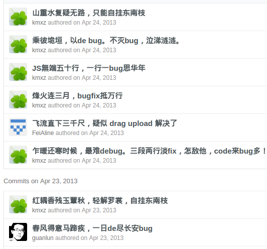
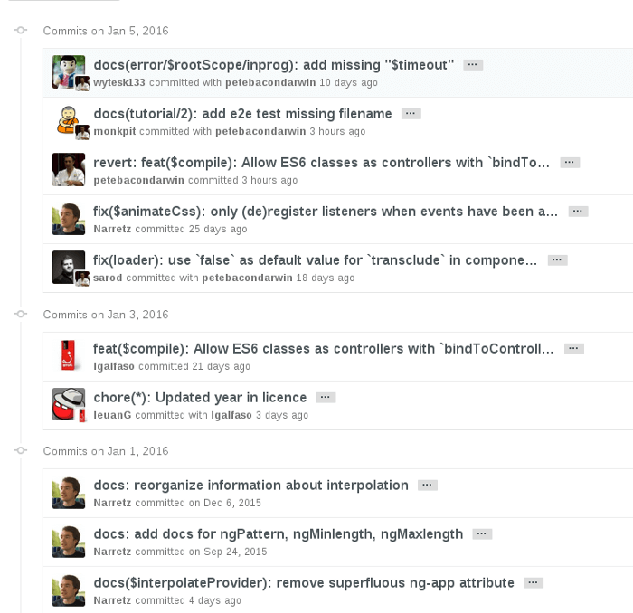
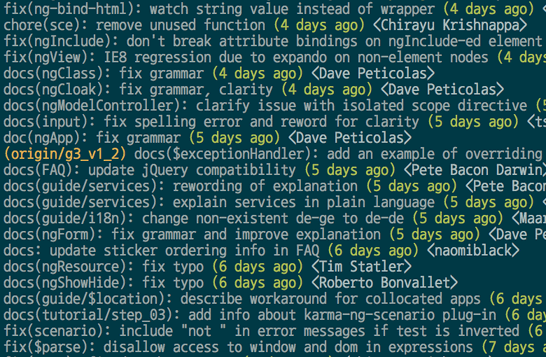
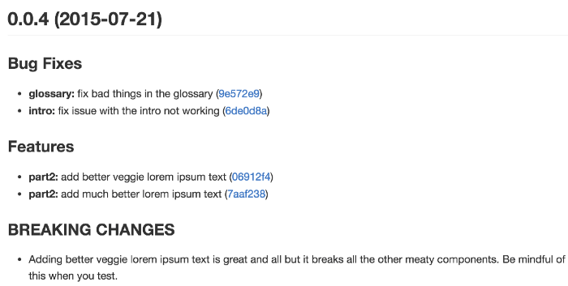
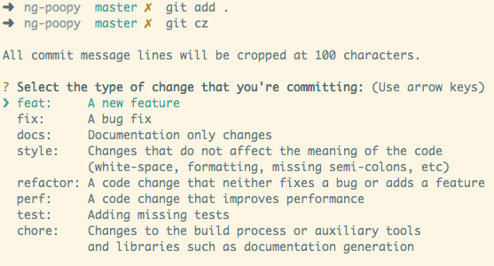

# [git commit 规范指南](https://segmentfault.com/a/1190000009048911)

> 复制自：[不挑食的程序员](https://segmentfault.com/blog/pines)

## 前言

Git 每次提交代码，都要写 Commit message（提交说明），否则就不允许提交。但是，一般来说，commit message 应该清晰明了，说明本次提交的目的。

不过话说回来，作为最具个人创造力和最会利用工具的物种——程序猿，最好是能有规范和工具的约束。否者的话，你可能看到以下的`commit message`：



目前，社区有多种 Commit message 的写法规范。本文介绍[Angular 规范](https://docs.google.com/document/d/1QrDFcIiPjSLDn3EL15IJygNPiHORgU1_OOAqWjiDU5Y/edit#heading=h.greljkmo14y0)是目前使用最广的写法，比较合理和系统化，并且有配套的工具。前端框架[Angular.js](https://github.com/angular/angular.js/blob/master/CONTRIBUTING.md#toc10)采用的就是该规范。如下图：



## Commit message 的作用

### 提供更多的历史信息，方便快速浏览。

比如，下面的命令显示上次发布后的变动，每个 commit 占据一行。你只看行首，就知道某次 commit 的目的。

```bash
$ git log <last tag> HEAD --pretty=format:%s
```



### 可以过滤某些 commit（比如文档改动），便于快速查找信息

```bash
$ git log <last release> HEAD --grep feature
```

### 可以直接从 commit 生成 Change log。

Change Log 是发布新版本时，用来说明与上一个版本差异的文档，详见后文。


### 其他优点

- 可读性好，清晰，不必深入看代码即可了解当前 commit 的作用。
- 为 Code Reviewing 做准备
- 方便跟踪工程历史
- 让其他的开发者在运行 git blame 的时候想跪谢
- 提高项目的整体质量，提高个人工程素质

## Commit message 的格式

每次提交，Commit message 都包括三个部分：header，body 和 footer。

```
<type>(<scope>): <subject>
<BLANK LINE>
<body>
<BLANK LINE>
<footer>
```

其中，header 是必需的，body 和 footer 可以省略。
不管是哪一个部分，任何一行都不得超过 72 个字符（或 100 个字符）。这是为了避免自动换行影响美观。

### Header

Header 部分只有一行，包括三个字段：`type`（必需）、`scope`（可选）和`subject`（必需）。

#### type

用于说明 commit 的类别，只允许使用下面 7 个标识。

- feat：新功能（feature）
- fix：修补 bug
- docs：文档（documentation）
- style： 格式（不影响代码运行的变动）
- refactor：重构（即不是新增功能，也不是修改 bug 的代码变动）
- test：增加测试
- chore：构建过程或辅助工具的变动

如果 type 为`feat`和`fix`，则该 commit 将肯定出现在 Change log 之中。其他情况（`docs`、`chore`、`style`、`refactor`、`test`）由你决定，要不要放入 Change log，建议是不要。

#### scope

scope 用于说明 commit 影响的范围，比如数据层、控制层、视图层等等，视项目不同而不同。

例如在`Angular`，可以是`$location`, `$browser`, `$compile`, `$rootScope`, `ngHref`, `ngClick`, `ngView`等。

如果你的修改影响了不止一个`scope`，你可以使用`*`代替。

#### subject

`subject`是 commit 目的的简短描述，不超过 50 个字符。

其他注意事项：

- 以动词开头，使用第一人称现在时，比如 change，而不是 changed 或 changes
- 第一个字母小写
- 结尾不加句号（.）

### Body

Body 部分是对本次 commit 的详细描述，可以分成多行。下面是一个范例。

```
More detailed explanatory text, if necessary.  Wrap it to
about 72 characters or so.

Further paragraphs come after blank lines.

- Bullet points are okay, too
- Use a hanging indent
```

有两个注意点:

- 使用第一人称现在时，比如使用 change 而不是 changed 或 changes。
- 永远别忘了第 2 行是空行
- 应该说明代码变动的动机，以及与以前行为的对比。

### Footer

Footer 部分只用于以下两种情况：

#### 不兼容变动

如果当前代码与上一个版本不兼容，则 Footer 部分以 BREAKING CHANGE 开头，后面是对变动的描述、以及变动理由和迁移方法。

```bash
BREAKING CHANGE: isolate scope bindings definition has changed.

    To migrate the code follow the example below:

    Before:

    scope: {
      myAttr: 'attribute',
    }

    After:

    scope: {
      myAttr: '@',
    }

    The removed `inject` wasn't generaly useful for directives so there should be no code using it.
```

#### 关闭 Issue

如果当前 commit 针对某个 issue，那么可以在 Footer 部分关闭这个 issue 。

```bash
Closes #234
```

### Revert

还有一种特殊情况，如果当前 commit 用于撤销以前的 commit，则必须以 revert:开头，后面跟着被撤销 Commit 的 Header。

```bash
revert: feat(pencil): add 'graphiteWidth' option

This reverts commit 667ecc1654a317a13331b17617d973392f415f02.
```

Body 部分的格式是固定的，必须写成`This reverts commit &lt;hash>`.，其中的 hash 是被撤销 commit 的 SHA 标识符。

如果当前 commit 与被撤销的 commit，在同一个发布（release）里面，那么它们都不会出现在 Change log 里面。如果两者在不同的发布，那么当前 commit，会出现在 Change log 的 Reverts 小标题下面。

## Commitizen

可以使用典型的 git 工作流程或通过使用 CLI 向导[Commitizen](https://github.com/commitizen/cz-cli)来添加提交消息格式。

### 安装

```bash
npm install commitizen --save-dev
```

然后，在项目目录里，运行下面的命令，使其支持 Angular 的 Commit message 格式。

```
commitizen init cz-conventional-changelog --save --save-exact
```

以后，凡是用到`git commit`命令，一律改为使用`git cz`。这时，就会出现选项，用来生成符合格式的 Commit message。


## validate-commit-msg

[validate-commit-msg](https://github.com/kentcdodds/validate-commit-msg) 用于检查项目的 Commit message 是否符合 Angular 规范。

该包提供了使用 githooks 来校验`commit message`的一些二进制文件。在这里，我推荐使用[husky](http://npm.im/husky)，只需要添加`"commitmsg": "validate-commit-msg"`到你的`package.json`中的`nam scripts`即可.

当然，你还可以通过定义配置文件`.vcmrc`来自定义校验格式。详细使用请见文档 [validate-commit-msg](https://github.com/kentcdodds/validate-commit-msg)


安装
```bash
npm install validate-commit-msg --save-dev
```

```json
// package.json
"husky": {
    "hooks": {
      "commit-msg": "validate-commit-msg"
    }
  }
```
每次git commit 的时候，这个脚本就会自动检查 Commit message 是否合格。如果不合格，就会报错。

```bash
$ git add -A 
$ git commit -m "edit markdown" 
INVALID COMMIT MSG: does not match "<type>(<scope>): <subject>" ! was: edit markdown
```

#### Husky
* [Husky](https://github.com/typicode/husky) 其实就是一个为 git 客户端增加 hook 的工具。将其安装到所在仓库的过程中它会自动在 .git/ 目录下增加commit-msg, pre-commit, pre-push钩子， 实现在提交的每个阶段执行相应的流程保证每一个 commit 的规范和正确性。

安装

```bash
npm install husky --save-dev
```

```json
// package.json
{
  "husky": {
    "hooks": {
      "commit-msg": "validate-commit-msg",
      "pre-commit": "cross-env NODE_ENV=production npm run lint",
      "pre-push": "npm run test"
    }
  }
}
```
如上配置，每次它只会在你本地 commit 之前，校验你提交的内容是否符合你本地配置的 eslint规则，如果符合规则，则会提交成功。如果不符合则会提示你错误，让你修复这个bug之后才允许本次提交。
### husky + lint-staged + Eslint 代码提交校验
#### lint-staged
* 为了杜绝不规范代码的提交，我们可以在package.json给husky > hooks > pre-commit钩子配置要执行的内容，我们要使用eslint对.js 和 .vue文件进行代码规范检查。
* 但是在遗留代码仓库上工作，开启 Lint 初期，你可能会面临成千上万的 Lint Error 需要修复。我们会遇到这种场景：只改了文件 A，但是存量文件 B、C、D 中也有大量错误。这时候就需要用到lint-staged，它可以只对暂存区代码规范进行校验。

安装
```bash
npm install lint-staged --save-dev
```

```json
// package.json
{
  "husky": {
    "hooks": {
      "commit-msg": "validate-commit-msg",
      "pre-commit": "lint-staged",
      "pre-push": "npm run test"
    }
  },
  "lint-staged": {
    "*.{js,vue}": "cross-env NODE_ENV=production npm run lint"
  },
}
```

> 最后，在多人协同共建的项目中我们很难保证所有项目成员都能遵循约定的工作流，所以如果想保证整个项目代码仓库符合eslint规范，我们还可以利用husky的另一个钩子pre-push，如下配置是在代码push到远程仓库前通过执行npm run lint对整个代码库执行一次校验操作，在遗留代码仓库工作不推荐使用。

```json
// package.json
{
  "husky": {
    "hooks": {
      "commit-msg": "validate-commit-msg",
      "pre-commit": "lint-staged",
      "pre-push": "cross-env NODE_ENV=production npm run lint"
    }
  },
  "lint-staged": {
    "*.{js,vue}": "cross-env NODE_ENV=production npm run lint"
  },
}

```

## 生成 Change log

如果你的所有 Commit 都符合 Angular 格式，那么发布新版本时， Change log 就可以用脚本自动生成。生成的文档包括以下三个部分：

- New features
- Bug fixes
- Breaking changes.

每个部分都会罗列相关的 commit ，并且有指向这些 commit 的链接。当然，生成的文档允许手动修改，所以发布前，你还可以添加其他内容。

[conventional-changelog](https://github.com/ajoslin/conventional-changelog) 就是生成 Change log 的工具，运行下面的命令即可。

```bash
$ npm install -g conventional-changelog
$ cd my-project
$ conventional-changelog -p angular -i CHANGELOG.md -w
```
